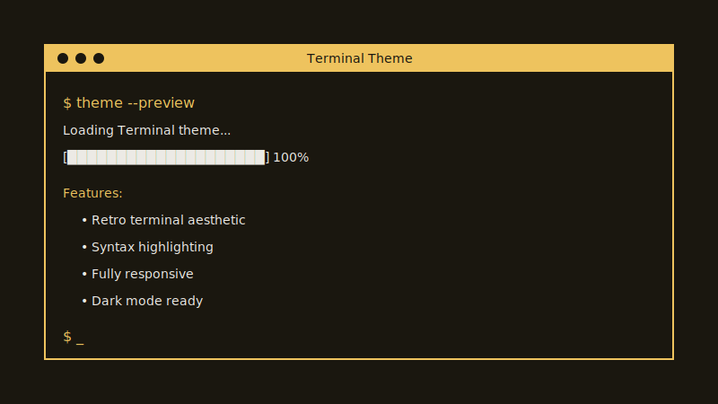

# Gen Yang's Personal Portfolio Website

A professional portfolio website built with Astro and the terminal theme, serving as both a public showcase and a control center for high-frequency trading systems. This project implements Part 1 of a comprehensive trading system development plan.



## Overview

This website serves multiple purposes:
1. **Professional Portfolio**: A modern, responsive showcase of Gen Yang's skills and projects in software engineering and quantitative finance
2. **Trading System Dashboard**: A control center for monitoring and managing high-frequency trading operations (integrated within the HFT project)
3. **Personal Gallery**: Showcasing experiences in billiards, tennis, and snowboarding

## Features

- **Terminal Aesthetic**: Clean, retro terminal-inspired design with monospace fonts
- **Fast Performance**: Built with Astro's static-first approach for optimal loading speeds
- **Responsive Design**: Works seamlessly across desktop and mobile devices
- **Trading Dashboard**: Interactive interface for real-time trading system monitoring (integrated within HFT project section)
- **Project Showcase**: Organized portfolio of technical projects and skills
- **Personal Gallery**: Sports and recreational activities showcase with philosophy on work-life balance
- **Professional Branding**: Clean navigation and modern layout with personal touch

## Tech Stack

- **Framework**: Astro v5 (Islands Architecture)
- **Styling**: Custom CSS with terminal theme
- **Font**: Fira Code monospace
- **Build Tool**: Vite
- **Deployment**: Ready for Vercel, Netlify, or any static host

## Quick Start

### Prerequisites
- Node.js 18.20.8 or higher
- npm or yarn package manager

### Development

1. **Clone and install dependencies**:
   ```bash
   git clone <your-repo-url> personal-website
   cd personal-website
   npm install
   ```

2. **Start development server**:
   ```bash
   npm run dev
   ```
   Visit http://localhost:4321

3. **For WSL2/Windows development** (access from Windows browser):
   ```bash
   npm run dev -- --host
   ```
   Visit the Network URL shown (e.g., http://172.x.x.x:4321)

4. **Build for production**:
   ```bash
   npm run build
   ```

5. **Preview production build**:
   ```bash
   npm run preview
   ```

## Project Structure

```
src/
├── layouts/
│   ├── BaseLayout.astro          # Main site layout with navigation
│   └── PostLayout.astro          # Blog post layout (inherited from theme)
├── pages/
│   ├── index.astro               # Homepage - Professional introduction
│   ├── about.astro               # About page - Background and skills
│   └── projects/
│       ├── index.astro           # Projects overview
│       └── hft-dashboard.astro   # Trading dashboard interface
├── components/
│   ├── PostCard.astro            # Blog post preview cards
│   └── FormattedDate.astro       # Date formatting utility
├── styles/
│   ├── terminal.css              # Core terminal theme styles
│   ├── main.css                  # Layout and utility styles
│   └── [other CSS files]        # Component-specific styles
└── content/
    └── posts/                    # Markdown blog posts (from theme)
```

## Key Pages

### Homepage (`/`)
- Professional introduction with terminal commands aesthetic featuring Gen Yang
- Skills overview organized by category
- Quick navigation to all sections

### About (`/about`)
- Detailed background about Gen Yang in software engineering and quantitative finance
- Technical expertise breakdown
- Current project focus and philosophy
- Contact information

### Projects (`/projects`)
- Portfolio overview with project cards
- Technology tags and status indicators
- HFT Trading System with integrated dashboard access
- Links to detailed project pages

### Gallery (`/gallery`)
- Sports and recreational activities showcase
- Billiards, tennis, and snowboarding experiences
- Philosophy on work-life balance and skill transfer
- Placeholder for future photos and videos

### HFT Dashboard (`/projects/hft-dashboard`)
- Trading system control interface (development preview)
- Real-time metrics panels (placeholder)
- System health monitoring
- Trading log and portfolio overview
- Now integrated within the HFT project section

## Customization

### Site Configuration
Edit `astro.config.mjs` to configure your domain and build settings:

```js
export default defineConfig({
  site: 'https://yourdomain.com',
  // Add other configuration options
});
```

### Navigation
Update navigation links in `src/layouts/BaseLayout.astro`:

```astro
<!-- Current navigation structure -->
<li><a href="/about">About</a></li>
<li><a href="/projects">Projects</a></li>
<li><a href="/gallery">Gallery</a></li>
```

### Styling
The terminal theme uses CSS custom properties. Modify colors in `src/styles/terminal.css`:

```css
:root {
  --background: #1a170f;
  --foreground: #eceae5;
  --accent: #eec35e;
  /* Other theme variables */
}
```

### Content
- Personal information updated throughout with Gen Yang's details
- Contact information added to About page
- Project descriptions customized in Projects page
- Gallery page created for sports and recreational activities
- Trading dashboard integrated within HFT project section

## Deployment

### Vercel (Recommended)
1. Push your code to GitHub
2. Connect repository to Vercel
3. Deploy automatically on every push
4. Configure custom domain in Vercel dashboard

### Netlify
1. Connect GitHub repository to Netlify
2. Set build command: `npm run build`
3. Set publish directory: `dist`
4. Deploy automatically

### GitHub Pages
1. Enable GitHub Pages in repository settings
2. Use GitHub Actions workflow (included)
3. Set source to "GitHub Actions"

### Manual/VPS Deployment
```bash
npm run build
# Upload dist/ folder to your web server
```

## Development Workflow

1. **Local Development**: Use `npm run dev -- --host` for WSL2 development
2. **Testing**: Run `npm run build` to test production builds
3. **Preview**: Use `npm run preview` to test built site locally
4. **Deploy**: Push to main branch for automatic deployment

## Future Enhancements

This website is designed to evolve with the trading system project:

- **Real-time Data Integration**: WebSocket connections for live trading metrics
- **Interactive Charts**: Financial data visualization components
- **System Controls**: Trading strategy management interface
- **Performance Monitoring**: System health and latency tracking
- **Risk Management**: Portfolio risk assessment tools

## WSL2/Windows Development Notes

When developing in WSL2 and testing in Windows browser:

1. Always use `npm run dev -- --host` to expose the server
2. Use the Network URL (not localhost) from Windows
3. Windows Defender might block the connection - add exception if needed
4. The IP address may change when WSL2 restarts

## License

This project is based on the Astro Terminal Theme by Dennis Klappe, which is a port of Hugo Terminal Theme by panr. All design credits go to the original creators.

## Contributing

This is a personal portfolio project, but suggestions and improvements are welcome through issues and pull requests.

---

**Part of the Personal Trading System Project** - A comprehensive system combining professional web presence with high-performance trading capabilities.